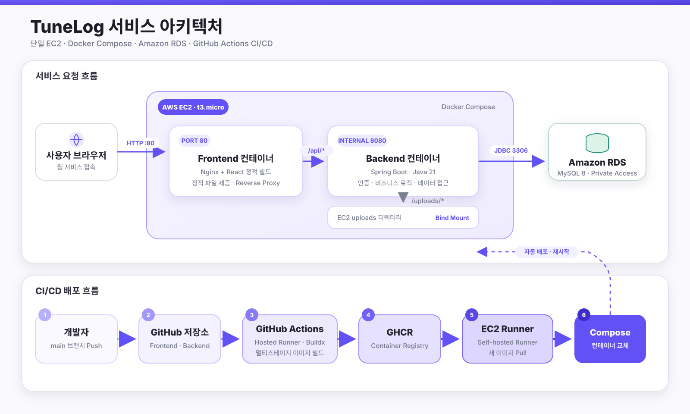
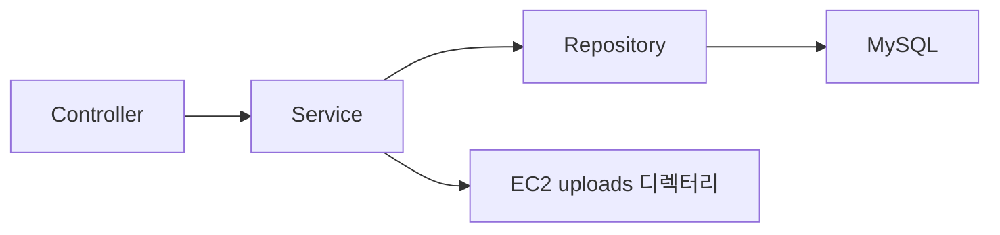
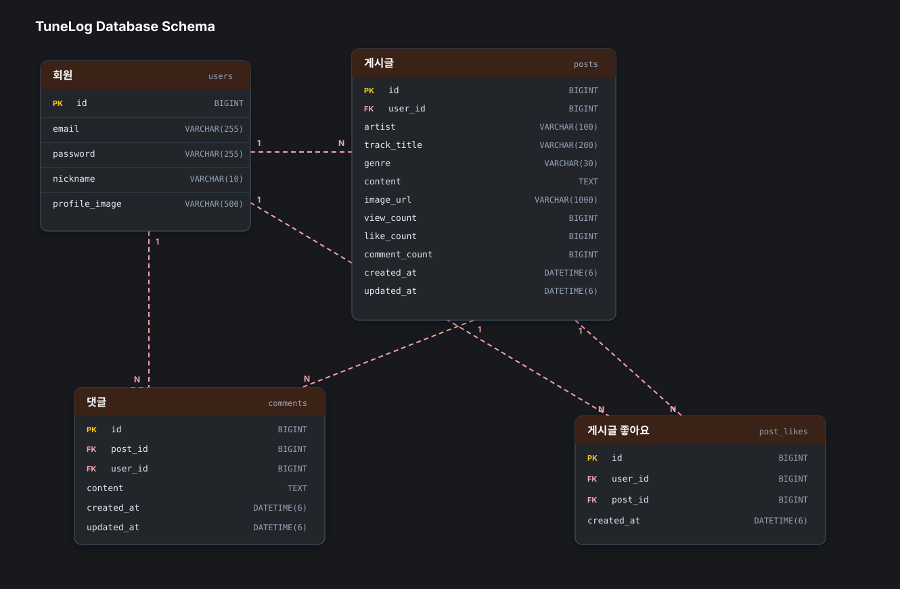
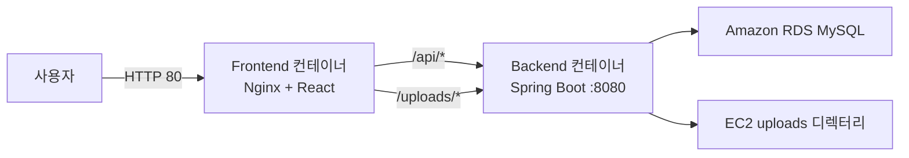

<p align="center">
  
</p>

<h1 align="center">TuneLog</h1>

<p align="center">좋아하는 음악과 감상평을 공유하는 음악 커뮤니티 REST API</p>

| 구분 | 주소 |
| --- | --- |
| 서비스 | [http://3.34.177.142](http://3.34.177.142) |
| API Base URL | [http://3.34.177.142/api](http://3.34.177.142/api) |
| Front-end 저장소 | [100-hours-a-week/KTB4_Justin_Week10](https://github.com/100-hours-a-week/KTB4_Justin_Week10) |

## Back-end 소개

- 좋아하는 음악과 감상평을 공유하는 음악 커뮤니티 서비스의 REST API 서버입니다.
- `Spring Boot 4`, `Java 21`, `MySQL`을 사용해 구현했습니다.
- Controller-Service-Repository 계층으로 HTTP 요청, 비즈니스 로직, 데이터 접근 책임을 분리했습니다.

### 개발 인원 및 기간

- 개발 기간: 2026.05 ~ 진행 중
- 개발 인원: 프론트엔드/백엔드 1명
- 개발자: [@shet6006](https://github.com/shet6006)

### 사용 기술 및 도구

| 구분 | 기술 |
| --- | --- |
| Core | Java 21, Spring Boot 4 |
| Web | Spring Web MVC, Bean Validation |
| Security | Spring Security, JWT, BCrypt |
| Database | MySQL 8, Spring Data JPA, Hibernate |
| API Docs | Swagger UI, springdoc-openapi |
| Test & Performance | JUnit, Mockito, Artillery |
| Deployment | Docker, Docker Compose, GitHub Actions, GHCR, AWS EC2, Amazon RDS |

## 서비스 아키텍처

<p align="center">
  
</p>

### 애플리케이션 계층



| 영역 | Controller | Service | Repository |
| --- | --- | --- | --- |
| 인증 | `AuthController` | `AuthService` | `UserRepository` |
| 사용자 | `UserController` | `UserService` | `UserRepository` |
| 게시글 | `PostController` | `PostService` | `PostRepository` |
| 댓글 | `CommentController` | `CommentService` | `CommentRepository` |
| 좋아요 | `PostLikeController` | `PostLikeService` | `PostLikeRepository` |
| 파일 | `FileUploadController` | `FileStorageService` | 로컬 파일 시스템 |
| 장르 | `GenreController` | - | `Genre` enum |

## 구현 기능

### Auth & Users

```text
- 회원가입과 로그인
- BCrypt 비밀번호 단방향 암호화
- JWT Access Token 발급과 인증 필터
- 인증 실패 401과 권한 부족 403 응답 분리
- 사용자 조회와 프로필·비밀번호 수정
- 회원 탈퇴 시 개인정보 익명화
```

### Posts

```text
- 게시글 CRUD와 작성자 권한 검사
- 곡명·가수·장르·감상평과 이미지 0~1장 저장
- 최신순·인기순·장르별 서버 페이지네이션
- 곡명·가수·작성자 통합 검색
- 검색어 자동완성 API
- 조회수 원자적 증가
- 목록 응답과 상세 응답 DTO 분리
```

### Comments & Likes

```text
- 댓글 CRUD와 10개 단위 서버 페이지네이션
- 게시글 좋아요 추가·취소
- 사용자가 좋아요를 누른 게시글 목록 조회
- 좋아요·댓글 수를 게시글 카운터 컬럼과 같은 트랜잭션에서 갱신
- 사용자와 게시글의 중복 좋아요를 DB UNIQUE 제약으로 방지
```

### Uploads & Genres

```text
- Multipart 이미지 업로드
- EC2 호스트 디렉터리와 컨테이너 업로드 경로 바인드 마운트
- 환경에 종속되지 않는 /uploads/... 상대 URL 응답
- 12개의 고정 음악 장르를 Genre enum으로 관리
- GET /genres에서 장르 코드와 표시명 제공
```

## 주요 API

- [TuneLog API 명세서 다운로드](docs/TuneLog_API_명세서.xlsx)

| Method | Endpoint | 설명 |
| --- | --- | --- |
| `POST` | `/auth/signup` | 회원가입 |
| `POST` | `/auth/login` | 로그인과 JWT 발급 |
| `GET` | `/posts` | 게시글 검색·필터·정렬·페이지 조회 |
| `GET` | `/posts/suggestions` | 검색어 자동완성 |
| `GET` | `/posts/liked` | 좋아요 게시글 페이지 조회 |
| `GET` | `/posts/{postId}` | 게시글 상세 조회 |
| `POST` | `/posts` | 게시글 작성 |
| `PATCH` | `/posts/{postId}` | 게시글 수정 |
| `DELETE` | `/posts/{postId}` | 게시글 삭제 |
| `GET` | `/posts/{postId}/comments` | 댓글 페이지 조회 |
| `POST` | `/posts/{postId}/likes` | 좋아요 추가 |
| `DELETE` | `/posts/{postId}/likes` | 좋아요 취소 |
| `POST` | `/uploads` | 이미지 업로드 |
| `GET` | `/genres` | 장르 목록 조회 |

게시글 목록 예시는 다음과 같습니다.

```http
GET /posts?page=0&size=10&genre=ROCK&sort=popular&keyword=oasis
```

## 데이터베이스 설계

<p align="center">
  
</p>

- [ERD 스냅샷 원본](docs/TuneLog_ERD_snapshot.json)

## 폴더 구조

<details>
<summary>폴더 구조 보기/숨기기</summary>

```text
.
├── .github
│   └── workflows
│       └── deploy-image.yml
├── deploy
│   └── mysql
│       └── schema.sql
├── performance
├── src
│   ├── main
│   │   ├── java/com/example/community
│   │   │   ├── config
│   │   │   ├── controller
│   │   │   ├── dto
│   │   │   ├── entity
│   │   │   ├── exception
│   │   │   ├── global
│   │   │   ├── repository
│   │   │   ├── security
│   │   │   └── service
│   │   └── resources
│   └── test
├── Dockerfile
├── docker-compose.yml
├── build.gradle
└── gradlew
```

</details>

## 로컬 실행

### 요구 사항

- Java 21
- MySQL 8

### 환경변수

Backend 루트의 `.env` 또는 실행 환경에 다음 값을 설정합니다.

```env
DB_URL=jdbc:mysql://localhost:3306/tunelog
DB_USERNAME=your_username
DB_PASSWORD=your_password
JWT_SECRET=replace_with_a_sufficiently_long_secret
JWT_ACCESS_TOKEN_EXPIRATION=1800000
UPLOAD_DIR=uploads
```

### 실행 명령

```bash
./gradlew bootRun
```

기본 서버 주소는 `http://localhost:8080`입니다.


```bash
./gradlew test
./gradlew clean bootJar
```

## 배포

Backend Dockerfile은 멀티스테이지 빌드를 사용합니다.

```text
Java 21 JDK 이미지에서 Gradle bootJar 실행
→ JAR 생성
→ Java 21 JRE 이미지에 JAR만 복사
→ 비루트 사용자로 실행하는 최종 이미지 생성
```

운영 구조는 다음과 같습니다.



`main` 브랜치에 변경사항이 반영되면 GitHub-hosted Runner가 Docker 이미지를 빌드해 GHCR에 Push합니다. 이후 EC2 Self-hosted Runner가 최신 이미지를 Pull하고 Docker Compose로 Backend 컨테이너를 교체한 뒤 API 응답을 확인합니다.

## 회고
단순히 API가 동작하도록 만드는 것을 넘어 데이터 구조와 계층별 책임, 성능을 함께 고려하는 과정이 어려웠습니다. 요청과 응답에 어떤 데이터를 포함할지 고민했고, 게시글 목록과 상세 화면의 목적에 맞게 응답 구조를 구분했습니다. DTO가 엔티티의 연관관계를 직접 탐색하지 않도록 조회와 응답 생성의 책임도 정리했습니다.

JPA를 사용하면서 지연 로딩과 N+1 문제를 직접 경험했습니다. 게시글 목록을 조회할 때 작성자, 이미지, 좋아요 수, 댓글 수를 게시글마다 반복해서 조회하던 부분을 발견했고, 연관 데이터를 함께 조회하거나 필요한 데이터를 묶어서 가져오도록 개선했습니다.

데이터베이스 구조도 서비스의 기능에 맞게 변경했습니다. 하나의 제목 문자열에 포함되어 있던 가수와 곡명을 별도 컬럼으로 분리하고 장르를 추가했으며, 이미지와 좋아요·댓글 수처럼 조회 과정에서 자주 사용하는 값도 구조를 변경했습니다. 기존 데이터를 유지하면서 로컬 MySQL과 RDS의 스키마를 변경하는 과정에서 데이터 마이그레이션의 중요성도 배웠습니다.

Spring Security와 JWT를 적용해 인증이 필요한 API를 앞단에서 보호하고, 사용자의 권한에 따라 게시글과 댓글을 수정하거나 삭제할 수 있도록 처리했습니다. 인증 실패와 권한 부족 등 클라이언트가 오류 원인을 정확하게 처리할 수 있도록 예외처리에도 신경 썼습니다.

배포 과정에서는 로컬 환경과 운영 환경의 설정을 분리하고, Spring Boot와 React에 멀티스테이지 Dockerfile을 적용했습니다. Docker Compose를 통해 프론트엔드와 백엔드 컨테이너를 함께 관리했으며, 운영 데이터베이스는 Amazon RDS를 사용해 클라우드 환경에 구성했습니다.
이후 GitHub Actions를 이용해 코드가 반영되면 Docker 이미지를 자동으로 빌드하고 GHCR에 저장한 뒤, EC2에서 최신 이미지를 내려받아 컨테이너를 교체하도록 CI/CD 파이프라인을 구성했습니다.

아직 개선할 부분은 많지만, 이번 프로젝트를 통해 기능 구현뿐만 아니라 설계, 구조, 성능, 보안, 배포까지 서비스 전체의 흐름을 바라보는 경험을 할 수 있었습니다.
