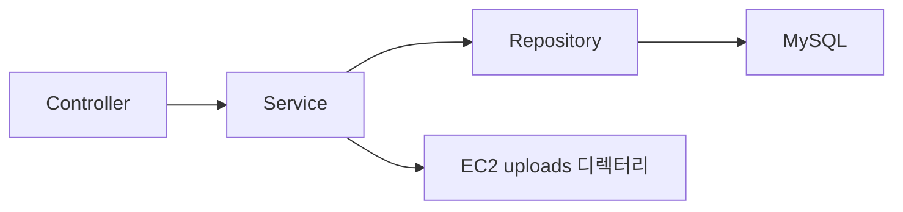
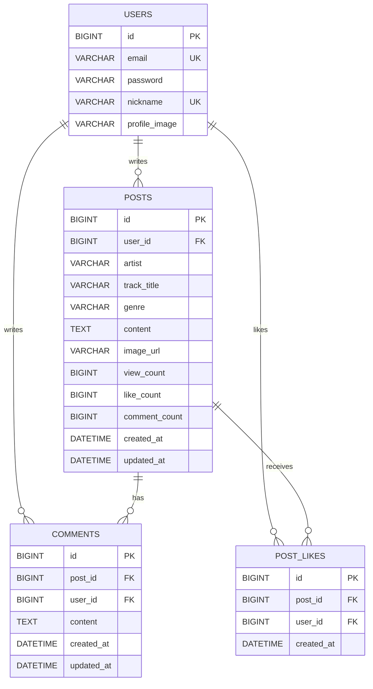
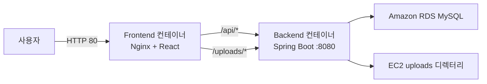

# 🎵 TuneLog

## Back-end 소개

- 좋아하는 음악과 감상평을 공유하는 음악 커뮤니티 서비스의 REST API 서버입니다.
- `Spring Boot 4`, `Java 21`, `MySQL`을 사용해 구현했습니다.
- Controller-Service-Repository 계층으로 HTTP 요청, 비즈니스 로직, 데이터 접근 책임을 분리했습니다.

### 개발 인원 및 기간

- 개발 기간: 2026.05 ~ 진행 중
- 개발 인원: 프론트엔드/백엔드 1명
- 개발자: [@shet6006](https://github.com/shet6006)

### 사용 기술 및 도구

| 구분 | 기술 |
| --- | --- |
| Core | Java 21, Spring Boot 4 |
| Web | Spring Web MVC, Bean Validation |
| Security | Spring Security, JWT, BCrypt |
| Database | MySQL 8, Spring Data JPA, Hibernate |
| API Docs | Swagger UI, springdoc-openapi |
| Test & Performance | JUnit, Mockito, Artillery |
| Deployment | Docker, Docker Compose, GitHub Actions, GHCR, AWS EC2, Amazon RDS |

### Front-end

- [TuneLog Front-end GitHub](https://github.com/100-hours-a-week/KTB4_Justin_Week10)

## 서버 구조



| 영역 | Controller | Service | Repository |
| --- | --- | --- | --- |
| 인증 | `AuthController` | `AuthService` | `UserRepository` |
| 사용자 | `UserController` | `UserService` | `UserRepository` |
| 게시글 | `PostController` | `PostService` | `PostRepository` |
| 댓글 | `CommentController` | `CommentService` | `CommentRepository` |
| 좋아요 | `PostLikeController` | `PostLikeService` | `PostLikeRepository` |
| 파일 | `FileUploadController` | `FileStorageService` | 로컬 파일 시스템 |
| 장르 | `GenreController` | - | `Genre` enum |

## 구현 기능

### Auth & Users

```text
- 회원가입과 로그인
- BCrypt 비밀번호 단방향 암호화
- JWT Access Token 발급과 인증 필터
- 인증 실패 401과 권한 부족 403 응답 분리
- 사용자 조회와 프로필·비밀번호 수정
- 회원 탈퇴 시 개인정보 익명화
```

### Posts

```text
- 게시글 CRUD와 작성자 권한 검사
- 곡명·가수·장르·감상평과 이미지 0~1장 저장
- 최신순·인기순·장르별 서버 페이지네이션
- 곡명·가수·작성자 통합 검색
- 검색어 자동완성 API
- 조회수 원자적 증가
- 목록 응답과 상세 응답 DTO 분리
```

### Comments & Likes

```text
- 댓글 CRUD와 10개 단위 서버 페이지네이션
- 게시글 좋아요 추가·취소
- 사용자가 좋아요를 누른 게시글 목록 조회
- 좋아요·댓글 수를 게시글 카운터 컬럼과 같은 트랜잭션에서 갱신
- 사용자와 게시글의 중복 좋아요를 DB UNIQUE 제약으로 방지
```

### Uploads & Genres

```text
- Multipart 이미지 업로드
- EC2 호스트 디렉터리와 컨테이너 업로드 경로 바인드 마운트
- 환경에 종속되지 않는 /uploads/... 상대 URL 응답
- 12개의 고정 음악 장르를 Genre enum으로 관리
- GET /genres에서 장르 코드와 표시명 제공
```

## 주요 API

| Method | Endpoint | 설명 |
| --- | --- | --- |
| `POST` | `/auth/signup` | 회원가입 |
| `POST` | `/auth/login` | 로그인과 JWT 발급 |
| `GET` | `/posts` | 게시글 검색·필터·정렬·페이지 조회 |
| `GET` | `/posts/suggestions` | 검색어 자동완성 |
| `GET` | `/posts/liked` | 좋아요 게시글 페이지 조회 |
| `GET` | `/posts/{postId}` | 게시글 상세 조회 |
| `POST` | `/posts` | 게시글 작성 |
| `PATCH` | `/posts/{postId}` | 게시글 수정 |
| `DELETE` | `/posts/{postId}` | 게시글 삭제 |
| `GET` | `/posts/{postId}/comments` | 댓글 페이지 조회 |
| `POST` | `/posts/{postId}/likes` | 좋아요 추가 |
| `DELETE` | `/posts/{postId}/likes` | 좋아요 취소 |
| `POST` | `/uploads` | 이미지 업로드 |
| `GET` | `/genres` | 장르 목록 조회 |

게시글 목록 예시는 다음과 같습니다.

```http
GET /posts?page=0&size=10&genre=ROCK&sort=popular&keyword=oasis
```

## 데이터베이스 설계



- 게시글 이미지는 0개 또는 1개이므로 별도 이미지 테이블 대신 `posts.image_url`에 저장합니다.
- 인기순 조회 시 매번 좋아요를 집계하지 않도록 `posts.like_count`를 사용합니다.
- 좋아요와 댓글 카운터는 생성·삭제 트랜잭션에서 원자적으로 증감합니다.
- `(user_id, post_id)` UNIQUE 제약으로 중복 좋아요를 방지합니다.
- 최신순·장르별·인기순·댓글 페이지 조회를 위한 복합 인덱스를 적용했습니다.

## 폴더 구조

<details>
<summary>폴더 구조 보기/숨기기</summary>

```text
.
├── .github
│   └── workflows
│       └── deploy-image.yml
├── deploy
│   └── mysql
│       └── schema.sql
├── performance
├── src
│   ├── main
│   │   ├── java/com/example/community
│   │   │   ├── config
│   │   │   ├── controller
│   │   │   ├── dto
│   │   │   ├── entity
│   │   │   ├── exception
│   │   │   ├── global
│   │   │   ├── repository
│   │   │   ├── security
│   │   │   └── service
│   │   └── resources
│   └── test
├── Dockerfile
├── docker-compose.yml
├── build.gradle
└── gradlew
```

</details>

## 로컬 실행

### 요구 사항

- Java 21
- MySQL 8

### 환경변수

Backend 루트의 `.env` 또는 실행 환경에 다음 값을 설정합니다.

```env
DB_URL=jdbc:mysql://localhost:3306/tunelog
DB_USERNAME=your_username
DB_PASSWORD=your_password
JWT_SECRET=replace_with_a_sufficiently_long_secret
JWT_ACCESS_TOKEN_EXPIRATION=1800000
UPLOAD_DIR=uploads
```

### 실행 명령

```bash
./gradlew bootRun
```

기본 서버 주소는 `http://localhost:8080`입니다.


```bash
./gradlew test
./gradlew clean bootJar
```

## 배포

Backend Dockerfile은 멀티스테이지 빌드를 사용합니다.

```text
Java 21 JDK 이미지에서 Gradle bootJar 실행
→ JAR 생성
→ Java 21 JRE 이미지에 JAR만 복사
→ 비루트 사용자로 실행하는 최종 이미지 생성
```

운영 구조는 다음과 같습니다.



`main` 브랜치에 변경사항이 반영되면 GitHub-hosted Runner가 Docker 이미지를 빌드해 GHCR에 Push합니다. 이후 EC2 Self-hosted Runner가 최신 이미지를 Pull하고 Docker Compose로 Backend 컨테이너를 교체한 뒤 API 응답을 확인합니다.

## 후기